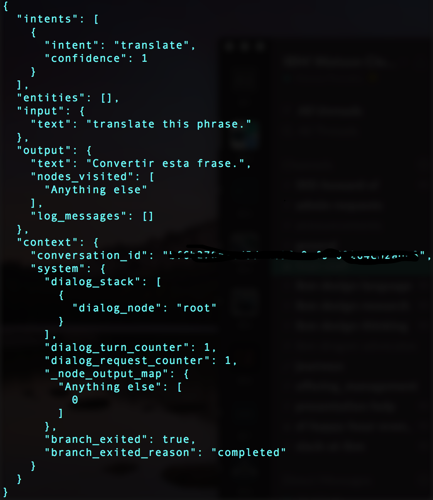

# Watson-Conversation-External-API

An example to help you get up and running with calling external APIs from Watson Conversation.
 
I have an intent
called 'translate' in the workspace I created, and when the user enters in a phrase and Watson recognizes the
'translate' intent, I call Watson Conversation and output the translated text.

 

To get started:

1) Create an instance of Watson Conversation and Watson Translation on Bluemix

2) Fill in Watson Conversation and Translation username and passwords at the top of conversation.js

3) Create an intent called 'translate' in your Workspace, and add the words 'translate this phrase' as a user example.

4) Fill in Watson Conversation workspace-id in conversation.js after creating the conversation instance.

5) Run <b> 'npm install' </b>

6) Run <b> 'npm start' </b>

<b><h4 id="setup">Results</h4></b>

Our console should look something like this if everything went smoothly. 

